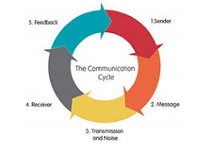
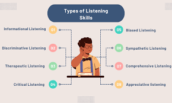
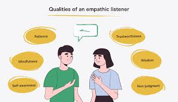
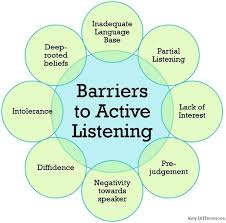

# Communication-Significance-of-Listening

##  Introduction
Communication is often described as the foundation of human relationships — the bridge that connects people, ideas, and emotions. However, communication is not just about speaking; it’s equally about *listening*. In fact, listening is one of the most critical yet underrated aspects of effective communication.

In an age where information travels faster than ever, genuine listening has become rare. Many people hear words but do not truly *listen* to understand. This article explores the importance of listening in communication, its role in personal and professional growth, and strategies for becoming a more active and empathetic listener.

<!-- Place Image 1: Communication Cycle -->

---

##  What Is Listening?
Listening is more than just hearing sounds or words. It involves **understanding, interpreting, and responding** to the message being conveyed. Unlike hearing, which is a physiological process, listening is a **cognitive and emotional activity** that requires attention and empathy.

There are different types of listening:
- **Active Listening** – Fully concentrating, understanding, and responding thoughtfully.  
- **Empathic Listening** – Understanding the speaker’s feelings and perspective.  
- **Critical Listening** – Evaluating the message to form judgments or make decisions.  
- **Appreciative Listening** – Listening for enjoyment, such as music or storytelling.  

Among these, *active and empathic listening* are the most important for building effective communication in both personal and professional contexts.

<!-- Place Image 2: Types of Listening -->

---

##  The Role of Listening in Communication
Listening forms the **core of successful communication**. It ensures that messages are correctly understood, reducing confusion and misunderstandings. A good listener not only absorbs information but also makes the speaker feel valued and respected.

Here’s how listening strengthens communication:
1. **Promotes Understanding** – Careful listening helps decode meaning and intent, ensuring messages are received accurately.  
2. **Builds Trust** – When individuals feel heard, it fosters mutual respect and strengthens relationships.  
3. **Encourages Openness** – People are more likely to share thoughts and emotions when they know they are being genuinely listened to.  
4. **Prevents Conflicts** – Many disagreements arise from miscommunication. Attentive listening reduces tension and encourages dialogue.  
5. **Enhances Learning** – In educational and workplace environments, effective listening promotes better comprehension and collaboration.  

Listening is not passive — it’s an *active skill* that requires patience, focus, and awareness.

---

##  Psychological Importance of Listening
From a psychological standpoint, listening satisfies one of the most basic human needs — the need to be understood. When someone listens attentively, it validates the speaker’s emotions and promotes psychological well-being.

Research in social psychology shows that **empathic listening** reduces stress, increases cooperation, and improves problem-solving. In therapy, counseling, and leadership, listening is often more impactful than advice. People often don’t need solutions — they need to feel heard and acknowledged.

Furthermore, in group or team settings, active listening enhances group dynamics. When every member feels included and respected, decision-making becomes more democratic, and morale improves.

---

##  Listening in the Workplace
In professional environments, listening is an essential leadership skill. Whether it’s a manager hearing out a team member’s concern or a customer support representative engaging with a client, listening determines the quality of workplace relationships and outcomes.

**Benefits of effective listening at work:**
- Boosts **team collaboration** and mutual respect.  
- Improves **customer satisfaction** and loyalty.  
- Enhances **employee engagement** and motivation.  
- Reduces **errors** caused by miscommunication.  

For leaders, listening is not just about gathering information — it’s about demonstrating empathy and fostering an environment of trust. Employees who feel listened to are more likely to stay motivated and aligned with organizational goals.

---

##  Listening in Personal Relationships
In personal life, listening is the foundation of emotional connection. Whether it’s among family, friends, or partners, active listening nurtures understanding and compassion.

When we listen without interrupting or judging, we allow the other person to express themselves freely. This openness strengthens relationships and reduces emotional distance. Poor listening, on the other hand, often leads to feelings of neglect, resentment, or frustration.

In relationships, the phrase “I understand how you feel” is powerful — but it only holds meaning when it comes from *genuine listening*.

<!-- Place Image 3: Empathic Listening Illustration -->

---

##  Barriers to Effective Listening
Despite its importance, many people struggle with listening effectively. Some common barriers include:
- **Distractions** (phones, environment, multitasking)  
- **Prejudgments or biases** toward the speaker  
- **Emotional reactions** that cloud understanding  
- **Information overload** in fast-paced environments  
- **Listening to respond**, not to understand  

Overcoming these barriers requires mindfulness and practice. Recognizing one’s listening habits is the first step toward improvement.

<!-- Place Image 4: Barriers to Listening -->

---

##  Strategies to Improve Listening Skills
Becoming a good listener is not an innate talent — it’s a skill that can be developed. Here are a few strategies:

1. **Be Present** – Eliminate distractions and focus fully on the speaker.  
2. **Show Engagement** – Maintain eye contact, nod, and use verbal affirmations like “I see” or “Go on.”  
3. **Avoid Interrupting** – Let the speaker complete their thought before responding.  
4. **Paraphrase and Reflect** – Repeat what you understood to confirm clarity.  
5. **Ask Open-Ended Questions** – Encourage deeper conversation and understanding.  
6. **Practice Empathy** – Try to understand the speaker’s emotions, not just their words.  

These habits, when practiced regularly, improve not only communication but also overall emotional intelligence.

---

##  The Broader Impact of Listening
Listening plays a significant role in shaping societies and cultures. In diplomacy, governance, and education, leaders who listen to their people make more inclusive and effective decisions. In a world divided by noise and misinformation, *listening is a form of respect and wisdom.*

When practiced collectively, active listening fosters tolerance, cooperation, and understanding across diverse communities. It transforms communication from a transaction into a connection.

---

##  Conclusion
The **significance of listening** in communication cannot be overstated. It’s not merely a skill — it’s a mindset rooted in respect, empathy, and understanding. Whether in personal life, education, or the workplace, listening forms the backbone of meaningful interaction.

In an era dominated by digital communication and constant distractions, genuine listening has become both rare and invaluable. To communicate effectively, we must not only *speak well* but also *listen deeply*.  
True communication begins not when we start talking — but when we start *listening*.

---

